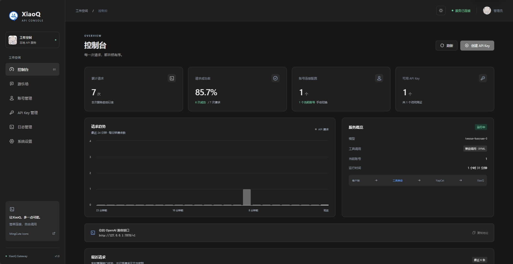

# XiaoQ 2API

将 NapCat 提供的 QQ HTTP API 封装为 OpenAI 兼容服务，可供 OpenAI SDK、聊天客户端及其他支持 OpenAI API 的应用调用。项目同时提供一个 Web 控制台，用于管理 NapCat 账号、客户端 API Key、工具兼容设置、日志和在线对话测试。



## 功能

- 提供 `GET /v1/models` 和 `POST /v1/chat/completions`，支持普通回复、流式响应（`stream: true`）及工具调用兼容。
- 根据当前启用的 NapCat 账号转发对话请求；账号切换、连接测试和 QQ 头像同步可在控制台中操作。
- 提供客户端 API Key 的创建、启用/停用和删除功能。新 Key 创建后请立即复制保存。
- 提供运行仪表盘、请求日志、配置面板和在线游乐场。
- 多个对话请求会串行处理，避免并发消息与回复交错。

## 环境要求

- Python 3.11 或更新版本。
- 一个正在运行且可从本机访问的 NapCat HTTP 服务。
- NapCat HTTP 地址和访问 Token；对外使用的 API Key。

## 安装

在项目根目录运行：

```bash
python -m pip install -r requirements.txt
```

## 配置

在项目根目录创建 `config.env`（该文件已加入 `.gitignore`），写入 NapCat HTTP 地址、NapCat Token 和本服务的初始 API Key：

```dotenv
base_url=http://127.0.0.1:3000
token=替换为你的NapCat_HTTP_Token
api_key=替换为足够随机的初始管理及客户端API_Key
```

`base_url` 填 NapCat HTTP 服务的根地址，不要附加具体动作路径。请勿把真实 Token 或 API Key 提交到代码仓库或发送到聊天记录中。

初始 `api_key` 用于登录 Web 控制台，也会作为默认客户端 Key。登录后可创建独立的客户端 Key；创建时显示的完整 Key 只供当次复制，后续在控制台中只能查看其掩码。

## 启动与停止

从项目根目录以前台方式启动整合服务：

```bash
python xaioq_api.py
```

服务默认监听 `0.0.0.0:7878`。浏览器访问 `http://127.0.0.1:7878/` 打开控制台；在启动服务的终端按 `Ctrl+C` 停止服务。

控制台登录状态保存在当前浏览器中，刷新或重新打开后会自动恢复；点击右上角的退出登录可清除该浏览器保存的状态。该状态不等于服务端会话，也不会更改 NapCat 或 API Key 配置。

## API 调用

API 根地址为 `http://127.0.0.1:7878/v1`。调用时在 `Authorization` 请求头中提供初始 API Key 或控制台创建并启用的客户端 Key。

### 查看模型

```bash
curl http://127.0.0.1:7878/v1/models \
  -H "Authorization: Bearer YOUR_API_KEY"
```

### Python 示例

安装依赖后，可使用项目已声明的 OpenAI Python SDK：

```python
from openai import OpenAI

client = OpenAI(
    api_key="YOUR_API_KEY",
    base_url="http://127.0.0.1:7878/v1",
)

response = client.chat.completions.create(
    model="tenxun-hunyuan-3",
    messages=[{"role": "user", "content": "你好"}],
)

print(response.choices[0].message.content)
```

流式请求可在 `chat.completions.create(...)` 中增加 `stream=True`，再迭代返回的 chunk。工具调用请求可使用 OpenAI Chat Completions 的 `tools` 和 `tool_choice` 字段；兼容层会处理工具调用格式及后续结果续接。

## Web 控制台

控制台地址：`http://127.0.0.1:7878/`。使用 `config.env` 中的初始 `api_key` 登录。控制台包含仪表盘、游乐场、账号管理、API Key 管理、日志和设置页面。

NapCat 账号保存在 `webui/data/console.json`，包括各账号的连接配置和 Token。该目录已加入 `.gitignore`。请将本服务绑定到可信网络，并妥善保管 `config.env` 与控制台数据文件。

## 项目结构

```text
xaioq_api.py             整合服务入口（API 与 Web 控制台）
toolforge/app/           API 适配、工具调用兼容及上游路由
webui/admin.py           控制台管理 API
webui/index.html         控制台页面
webui/assets/            前端脚本、样式与 SVG 图标
webui/data/              运行时控制台数据（自动创建，已忽略）
config.env               本地 NapCat 与服务密钥配置（自行创建，已忽略）
img/dashboard.png        控制台示例截图
test_console.py           控制台与管理 API 测试
test_integration.py       API 网关集成测试
test_tools.py             工具调用相关测试
test.py                   简单接口测试脚本
```

## 测试

```bash
python -m unittest test_console test_integration -v
python -m unittest test_tools -v
```

测试使用临时数据和模拟上游，不会写入正式控制台账号数据。完整功能验证仍需在本机配置可用的 NapCat 服务后进行。

## 免责声明

本项目用于个人学习和技术研究。NapCat、腾讯 QQ 及相关服务由其各自提供方维护，接口行为和可用性可能变化。使用者应遵守相关服务条款，并自行承担部署、密钥保管及使用本项目产生的后果。
